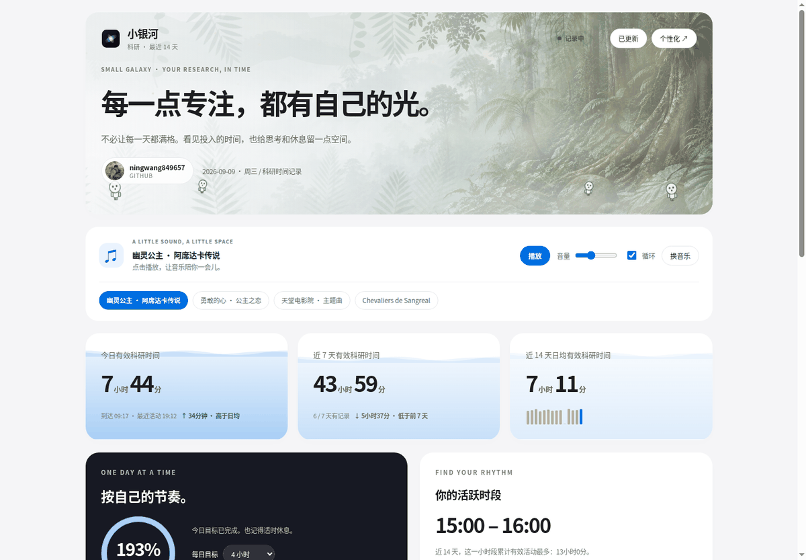
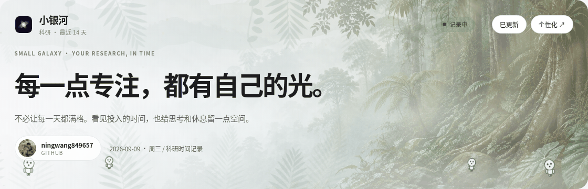
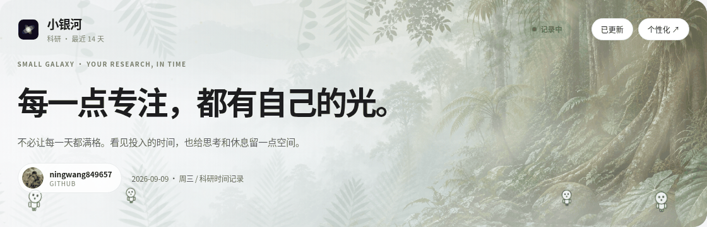
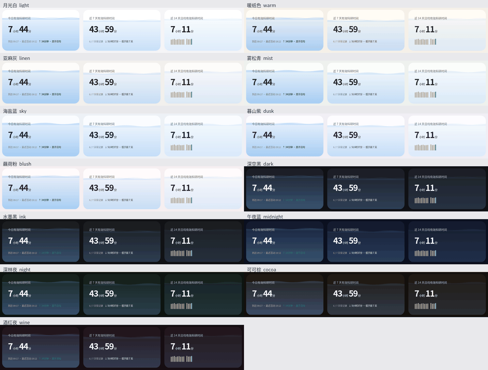
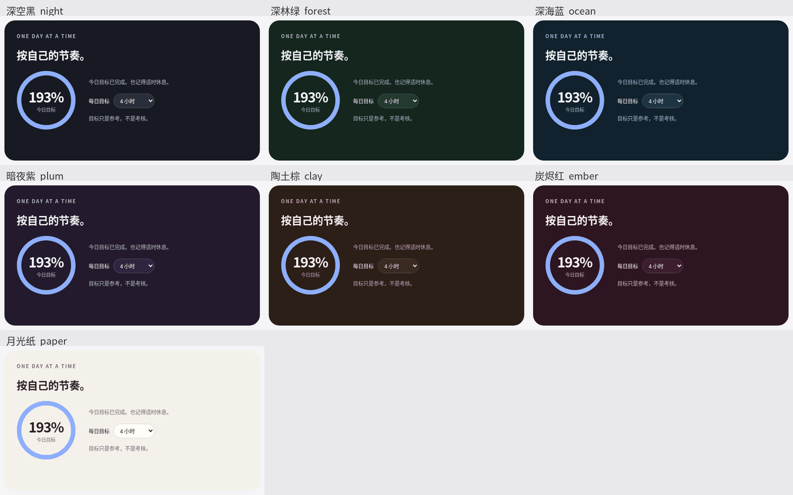
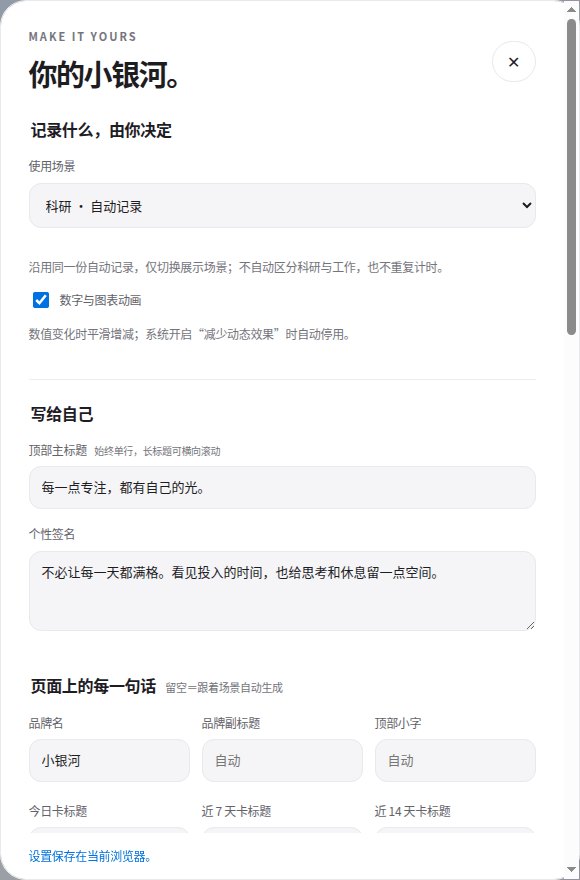
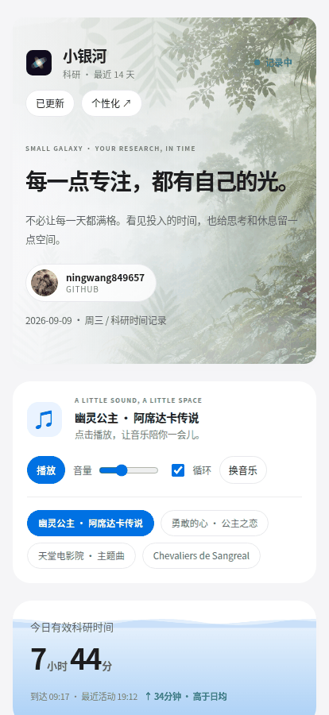

# 小银河 Small Galaxy

一个只跑在本机的科研时间仪表盘。后台每分钟采样一次电脑活动，推算每天到实验室和离开的时间、排除中断后的「有效科研时间」，再渲染成一页可以彻底改成你自己样子的页面。

统计与页面在本机生成，插画随安装包提供。**页面打开时不向任何外部服务发一个请求** —— 连头像和插画都是内嵌到 HTML 的。



## 它能做什么

**记录**　每 60 秒采一次系统空闲时间，同时记下前台窗口标题，写成按天分文件的 CSV。刷 bilibili / YouTube 的时间会单独归为「娱乐」，不算进有效时间。原始日志只留在 `~/.lab_tracker/`，不上传、不出本机。

**统计**　今日 / 近 7 天 / 近 14 天日均三张时间卡、14 天堆叠柱状图、单日 24 小时时间线、按小时累计的活跃时段、最长连续活动与 ≥25 分钟片段，都能导出 CSV。

**四种场景**　科研、工作、运动、自定义。科研与工作共用同一份自动采样，只换名字；运动和自定义可以改成手动填写起止时间，与自动记录完全分开存放，不会把敲键盘当成跑步。

**背景音乐**　把音频文件丢进 `~/.lab_tracker/music/`，卡片上就出现曲目按钮。也内置了四首（幽灵公主、勇敢的心、天堂电影院、Chevaliers de Sangreal），都挑的是允许内嵌播放的官方乐团／版权方上传。播放器被移出视口，页面上不会出现视频框。

**几乎每一句话都能改**　品牌名、副标题、三张卡的标题、页脚、底部说明……留空就跟着场景自动生成，填了就一直用你写的。

### 时间卡是会涨的水位

下深上浅，水面有两条不同速度的波浪，高度按真实数值相对每日目标涨落，从当前水位逐渐升到真实值——不会先冲高再回落。三张卡由深到浅，一眼看出主次。

### 会下雨的雨林

顶部是一幅《幽灵公主》元素的森林长卷：白狼、红白面具、山兽神、苔藓古树与会轻轻歪头的木灵。下方雨林模拟晨雾 → 林冠渐暖 → 午后积云 → 阵风骤雨 → 叶尖滴水、水汽回升 → 雨后透光。插画由 AI 生成并随页面内嵌，动态由 SVG/CSS 绘制，不使用影片截图；这是氛围模拟，不是实时天气。

| 晨雾 | 暴雨 | 雨后透光 |
| --- | --- | --- |
|  |  |  |

### 13 套页面风格

外加 7 种强调色和一个取色器。每套配色的对比度都有测试守着，正文 ≥ WCAG AAA，次级文字 ≥ AA。



### 目标卡 7 套配色



### 全部设置在一个面板里，窄屏也能用

外观、文案、配色、天气、装饰浓度、音乐来源，改完即时生效，存在浏览器本地。窄屏下图表横向滚动，坐标轴不会被压扁。

| 个性化面板 | 窄屏 |
| --- | --- |
|  |  |

## 系统要求

只用 Python 3 标准库，不需要 pip 装任何东西。采样这一层按平台分成了不同后端，启动时自动选：

| 系统 | 取空闲时间 | 取窗口标题 | 额外依赖 |
| --- | --- | --- | --- |
| Linux / X11 | `libXss`（ctypes 直调） | `libX11`（ctypes 直调） | **无** |
| Linux / Wayland（GNOME） | Mutter 的 D-Bus 接口 | ⚠️ 拿不到 | `gdbus`（glib2 自带） |
| Linux / Wayland（KDE 等） | `org.freedesktop.ScreenSaver` | ⚠️ 拿不到 | 同上 |
| Windows 10/11 | `GetLastInputInfo` | `GetForegroundWindow` | **无** |
| macOS | `ioreg` 的 `HIDIdleTime` | `osascript` | 无（标题需「辅助功能」授权） |

⚠️ **Wayland 读不到窗口标题**，这是它有意的安全设计，不是缺陷。时间统计完全正常，只是「娱乐时间」不会被单独拆出来。

先确认你这台机器能用哪个后端：

```bash
python3 -m smallgalaxy.probes    # 打印选中的后端、当前空闲秒数和窗口标题
```

## 安装

**Linux —— 下载 AppImage，双击即用**

到 [Releases](https://github.com/ningwang849657/small-galaxy/releases) 下载 `SmallGalaxy-x86_64.AppImage`：

```bash
chmod +x SmallGalaxy-x86_64.AppImage
./SmallGalaxy-x86_64.AppImage      # 打开仪表盘，并自动开始后台记录
```

不需要装 Python 包，也不需要 `apt install` 任何东西（只用到系统自带的 python3 和 X11 库）。

**第一次打开会是空的** —— 数据要靠后台采样收集，每 60 秒一次。所以打开仪表盘时会顺手把采样进程拉起来（已经在跑就不会重复启动），页面上也会说明当前状态。约一分钟后出现第一根柱子，页面每分钟自己刷新。

不想让它自动启动就设 `SMALL_GALAXY_NO_DAEMON=1`，再手动跑 `./SmallGalaxy-x86_64.AppImage --daemon`。

**任意平台 —— pip**

```bash
pip install small-galaxy

small-galaxy            # 打开仪表盘（顺带自动开始后台记录）
small-galaxy-daemon     # 只跑采样，前台，看得到日志
small-galaxy-report     # 命令行日报/周报
```

**从源码跑**

```bash
git clone https://github.com/ningwang849657/small-galaxy.git
cd small-galaxy
python3 -m smallgalaxy.lab_tracker    # 采样
python3 -m smallgalaxy.dashboard      # 仪表盘
```

开机自启的模板在 `autostart/`（Linux systemd unit、macOS launchd plist、Windows 启动脚本），装法见[详细说明](docs/manual.md)。

```bash
python3 -m unittest discover -s tests -p 'test_*.py'   # 单元测试
python3 tests/browser_smoke.py                          # 浏览器端到端（需 Chrome）
./packaging/build-appimage.sh                           # 自己打 AppImage
```

## 这些数字不等于科研产出

它测的是「电脑在被使用」，不是「你在思考」。看书、讨论、在纸上推公式都会被算成空闲；对着屏幕发呆则会被算成有效。无记录的日子不参与日均。请把它当成一面镜子，不是一把尺子。

## 文档

完整的功能细节、安装步骤、算法说明和已知局限：**[docs/manual.md](docs/manual.md)**
